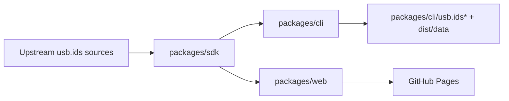

# Architecture

## Package Topology

## Responsibilities

### `packages/sdk`

- Fetch layer (`src/fetcher`)
- Parser + schema transforms (`src/parser`, `src/legacy`)
- Query helpers (`src/pure/query`)
- Repository/service orchestration (`src/repository`, `src/service`)
- Internal Node/browser API source and shared types (not independently published)

### `packages/cli`

- Command runtime (`src/cli.ts`)
- Published binary `usb-ids`
- CLI-owned data files: `usb.ids`, `usb.ids.json`, `usb.ids.version.json`
- Data artifact generation (`scripts/build-artifacts.ts` -> `dist/data/*`)

### `packages/web`

- Vite search UI (`app/*`)
- Uses shared browser/query contracts from workspace SDK modules
- Built and deployed separately to Pages

## Data Versioning

- Manifest uses CalVer-style release version: `schemaMajor.YYYYMMDD.N`
- `upstreamHash` is SHA-256 of upstream source content
- Auto-update compares upstream hash with npm latest manifest to skip no-op releases

## Repository Layer

- Root package is private monorepo orchestration only
- CI validates: OpenSpec, format, lint, typecheck, test, build
- OpenSpec change `agent-first-monorepo` tracks migration tasks/spec contracts
