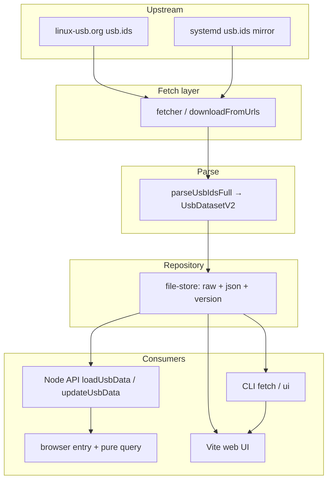

# Architecture

## High-level flow

## Modules

| Layer | Role |
|-------|------|
| `src/fetcher` | HTTP GET with retries, timeouts, `Accept-Encoding` |
| `src/parser` | Line-based state machine for full `usb.ids`; hash + version metadata |
| `src/repository` | Read/write `usb.ids`, `usb.ids.json`, `usb.ids.version.json` |
| `src/service` | Orchestrates fetch → parse → persist version info |
| `src/node/data` | Package-root resolution + `loadUsbData` / `updateUsbData` |
| `src/pure/query` | Vendor/device filter + search (shared Node/browser) |
| `src/legacy/to-v1` | v2 dataset → legacy `Record<vid, UsbVendor>` |
| `scripts/build-artifacts.ts` | Emits `dist/data/*` (min, compact, shards, compressed, version manifest) |

## Versioning

- **npm / `usb.ids.version.json`:** CalVer `2.YYYYMMDD.N` after the 2.x cut, aligned with automated releases.
- **Content:** `contentHash` (SHA-256 of raw `usb.ids` text) drives “needs update” in CI vs published npm payload.
